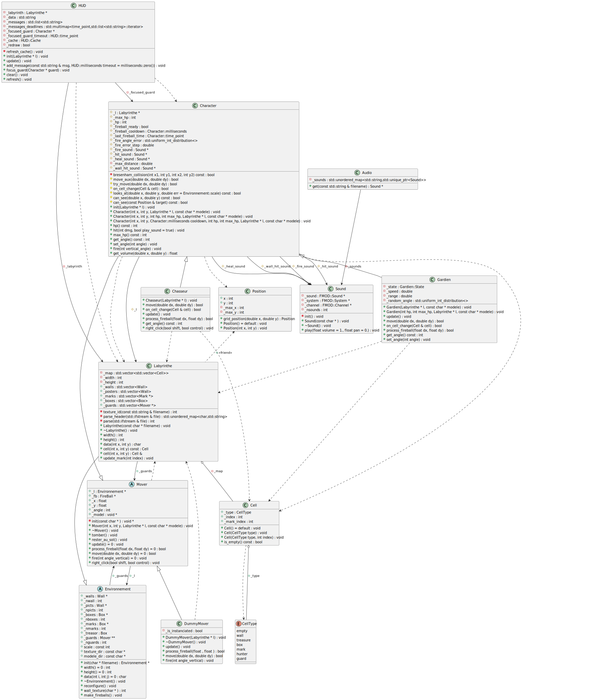

# Compilation

Le projet peut être compilé en utilisant make :
```bash
make [OS=Ubuntu]
./labh -l mazes/labyrinthe.txt -a
```
Ou cmake (testé sous fedora) :
```bash
cmake -S . -B build [-DUBUNTU]
cmake --build build
./build/labh -l mazes/labyrinthe.txt -a
```

# Résumé

La plupart des fonctionalités demandées on été implémentées :
- les labyrinthes sont correctement lus par le programme (même si ils ne sont pas collés "au bord" du fichier,
  voir `mazes/float.txt`)
- les gardiens changent de direction aléatoirement lorsqu'ils rencontrent un obstacle
- un gardien passe en mode attaque et tire sur le chasseur lorsqu'il est dans son champ de vision
- les personnages tirent avec moins de précision lorsque leurs points de vie diminuent
- Possibilité d'utiliser des téléporteurs
- Possibilité d'utiliser des marques de soin
- Un clic droit en direction d'un gardien visible affiche ses informations à l'écran (reset avec ctrl + clic droit)
- La partie se termine lorsque le chasseur n'a plus de points de vie ou lorsqu'il touche le trésor

D'autres fonctionnalités, comme les murs destructibles, auraient pu être implémentées.

Des labyrinthes montrant certaines fonctionalités sont présents dans le dossier `mazes`, notamment `labyrinthe.txt`
pour un labyrinthe de grande taille et `teleport.txt` pour un labyrinthe contenant des téléporteurs et des marques
de soin.

**Note :** J'ai utilisé la bibliothèque fmt (https://fmt.dev/) pour tout ce qui concerne l'affichage de messages dans
le terminal et le formatage de chaînes de caractères.

# Difficultés rencontrées

La gestion des angles pour les intéractions chasseur-gardiens a été compliquée à implémenter, en particulier
trouver le sens des repères utilisés (repère du labyrinthe, repère des angles pour le chasseur, les gardiens).

Comprendre comment est gérée la hitbox des personnages a aussi été un problème (en l'état, les hitboxs des gardiens sont la plupart du temps une peu décalées dans mon projet).

# Description du code

## Labyrinthe

### Lecture du labyrinthe

La lecture du labyrinthe est effectuée en 2 étapes :
1. la lecture de la première partie contenant les textures (un caractère suivi d'un espace et d'un nom de fichier) et des commentaires, la lecture s'arrête lorsqu'un caractère '+' est rencontré en début de ligne.
2. la lecture du labyrinthe en lui même, effectuée en une passe.

Le labyrinthe est composé :
- de murs ('+', '-', '|')
- d'un chasseur ('C')
- de gardiens ('G')
- d'un trésor ('T')
- de boîtes ('X')
- de marques ('M')
- de marques de soin ('H')
- d'affiches ('a' .. 'z')
- de téléporteurs ('0' .. '9')

### Implémentation

Le labyrinthe est implémenté comme un tableau bidimensionnel de cellules, une cellule est définie par le type suivant :
```cpp
struct Cell {
	CellType _type;
	int _index;
	int _mark_index;
	// ...
};
```
Avec :
- `_type` : le type de la cellule, `CellType` est une énumération donnant les types de cellules possibles :
  ```cpp
  enum class CellType {
	empty,
	wall,
	treasure,
	box,
	mark,
	hunter,
	guard
  }
  ```
- `_index` : l'indice de l'objet se trouvant sur la cellule, par exemple si une cellule `c` est de type `guard`, alors sa variable `_index` correspondra à l'indice du gardien qui s'y trouve, dans le tableau `_guards` du labyrinthe. Cela permet par exemple de récupérer un garde à partir d'une cellule, sans avoir à itérer sur tous les gardes.
- `_mark_index` : donne l'indice de la marque se trouvant sur cette cellule dans le tableau `_marks` du labyrinthe, si la cellule ne contient pas de marque, alors `c._mark_index == -1`.


## Personnages

Tous les personnages héritent d'une classe abstraite `Character`, classe fille de `Mover`, qui implémente les méthodes et attributs communs aux gardiens et aux chasseurs, notamment :
- les points de vie (attributs et fonction utilisée pour gérer les coups)
- les mouvements (déplacements, interactions avec les cellules spéciales)
- la vision (fonctions indiquant si un personnage regarde en direction d'une cellule particulière et si il n'y a pas d'obstacle entre deux cellules).
- la gestion des boules de feu (malus de précision selon les points de vie, délai de rechargement)

### Gardiens

Les gardiens se déplacent aléatoirement dans le labyrinthe, en changeant de direction en cas de collision.
Lorsqu'un gardien voit le chasseur, il se rapproche de lui pour être à distance de tir (qui est un paramètre de la classe `Gardien`) puis tire en direction du chasseur.

Un gardien arrête de suivre le chasseur lorsque celui-ci sort de son champ de vision (en passant derrière un mur ou une boîte par exemple).
Lorsqu'un chasseur n'a plus de points de vie, il est supprimé de la carte.

### Chasseur

Le chasseur est contrôlé par l'utilisateur, il n'ajoute pas énormément de fonctionnalités à la classe `Character`.

### DummyMover

Classe fille de Mover dont la seule utilité est de créer un unique garde inactif et hors labyrinthe, pour pouvoir appeler la fonction update du chasseur.


## Marques

Il existe trois types de marques :
- les marques normales, qui ont juste un rôle esthétique
- les marques de soin, des marques à usage unique qui soignent le chasseur de 20 points de vie lorsqu'il marche dessus.
- les téléporteurs, des marques qui déplacent le joueur vers un téléporteur cible lorsqu'il marche dessus.

### Marques de soin

Les marques de soin rendent un certain nombre de points de vie au chasseur lorsqu'il marche dessus. Elles n'ont pas d'effet sur les gardiens.

### Téléporteurs

Les téléporteurs fonctionnent par paires, quand le chasseur se déplace sur un téléporteur, il est déplacé vers le téléporteur correspondant, ou rien ne se passe si le téléporteur n'a pas de destination.
Les gardiens ne peuvent pas se déplacer sur un cellule contenant un téléporteur.


## Autres classes / fichiers

### HUD

Gère l'affichage de messages temporaires en haut de l'écran.

### Audio

Gère le chargement des fichiers audio (permet de ne charger un fichier qu'une fois même si il est utilisé par plusieurs classes).

### Util

Module contenant des fonctions utilitaires (conversion radians - degrés, aléatoire, distance). 

## Diagramme de classes



